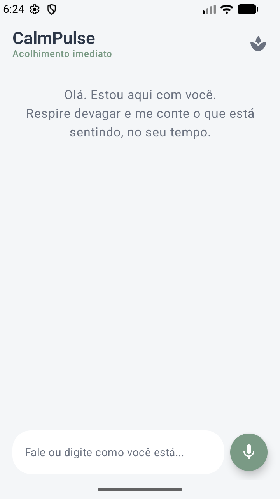
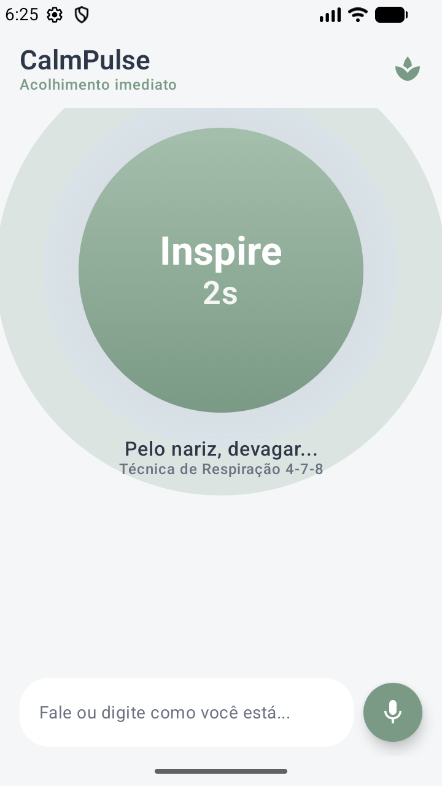
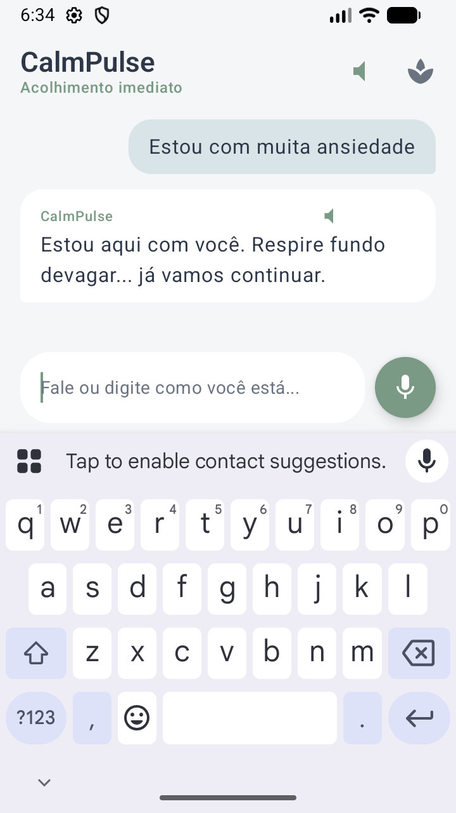

# CalmPulse 🌿
> **Assistente Móvel de Acolhimento e Estabilização Emocional com IA Integrada**  
> Aplicativo Android Nativo desenvolvido em **Kotlin** e **Jetpack Compose** com foco em momentos de crise aguda de ansiedade e pânico.

---

## 🌟 1. Visão do Produto & Regra de Ouro: Fricção Zero

Em estados de estresse elevado ou princípio de pânico, o córtex pré-frontal do usuário opera sobrecarregado. Qualquer barreira cognitiva (telas de login, senhas esquecidas, termos de aceite extensos ou menus complexos) é um fator de desistência e agravamento do sofrimento.

### Pilares de UX:
* **Entrada Imediata:** O aplicativo abre diretamente na interface de suporte emocional.
* **Acesso Rápido a Áudio e Texto:** O usuário pode alternar entre leitura/digitação e escuta/voz com apenas um toque.
* **Respostas em Streaming Contínuo:** Redução da ansiedade de espera; a IA responde token a token via `Flow<String>`, sem silêncios de 5 a 10 segundos.
* **Resiliência e Falha Graciosa:** Em caso de perda de conexão ou indisponibilidade, o app nunca exibe logs técnicos ("HTTP 500", "Timeout"), respondendo com a mensagem acolhedora:  
  > *"Estou aqui com você. Respire fundo devagar... já vamos continuar."*

---

## 🏛️ 2. Arquitetura e Stack Tecnológica

O projeto foi construído seguindo os princípios de **Clean Architecture** e padrão **MVVM (Model-View-ViewModel)** com fluxos reativos puros.

| Camada | Tecnologia | Papel e Responsabilidade |
| :--- | :--- | :--- |
| **Linguagem & UI** | Kotlin + Jetpack Compose (Material 3) | Arquitetura reativa declarativa, animações de pulso para respiração e layout relaxante |
| **Arquitetura Base** | MVVM + `StateFlow` | Desacoplamento estrito entre UI, lógica de apresentação e chamadas assíncronas |
| **Concorrência & Fluxo** | Coroutines + Kotlin `Flow` | Streaming de tokens de IA sem bloqueio da `MainThread` |
| **Inteligência Artificial** | Google Generative AI SDK (Gemini 1.5 Flash) | Geração de respostas empáticas guiadas por System Prompt estrito |
| **Voz (STT & TTS)** | `SpeechRecognizer` + `TextToSpeech` nativo | Entrada por voz acessível e síntese com cadência desacelerada (`0.85x` rate, `0.90x` pitch) |
| **Empacotamento** | Gradle + Signing Config | Geração do bundle assinado otimizado (`.aab`) para Google Play |

---

## 📁 3. Estrutura de Pastas

```
c:\dev\CalmPulse\
├── app/
│   ├── src/main/
│   │   ├── AndroidManifest.xml          # Permissões de Internet e Áudio + Sem Login
│   │   ├── java/com/calmpulse/
│   │   │   ├── audio/
│   │   │   │   ├── VoiceRecognizer.kt   # Captura STT (SpeechRecognizer)
│   │   │   │   └── VoiceSpeaker.kt      # Reprodução TTS serena (TextToSpeech)
│   │   │   ├── data/
│   │   │   │   ├── model/
│   │   │   │   │   └── ChatMessage.kt   # Modelos de dados do Chat
│   │   │   │   └── repository/
│   │   │   │       └── GeminiChatRepository.kt # Streaming do Gemini com tratamento gracioso
│   │   │   ├── domain/
│   │   │   │   ├── prompt/
│   │   │   │   │   └── SystemPrompt.kt  # Protocolos Clínicos (5-4-3-2-1 e 4-7-8)
│   │   │   │   └── repository/
│   │   │   │       └── ChatRepository.kt # Contrato da Clean Architecture
│   │   │   ├── ui/
│   │   │   │   ├── chat/
│   │   │   │   │   ├── ChatScreen.kt    # Tela Principal de Acolhimento e Chat
│   │   │   │   │   └── ChatViewModel.kt # Gerenciador de Estados da UI (MVVM)
│   │   │   │   ├── components/
│   │   │   │   │   ├── BreathingCircle.kt # Círculo animado da Respiração 4-7-8
│   │   │   │   │   └── ChatBubble.kt    # Balões minimalistas com controle de áudio
│   │   │   │   └── theme/
│   │   │   │       ├── Color.kt         # Paleta Calmante (Sálvia, Lavanda, Névoa)
│   │   │   │       ├── Theme.kt         # Tema Material 3
│   │   │   │       └── Type.kt          # Tipografia suave
│   │   │   └── MainActivity.kt          # Ponto de entrada imediato
│   │   └── res/values/
│   │       ├── strings.xml
│   │       └── themes.xml
│   ├── calmpulse-release.jks            # Keystore de release configurada
│   └── build.gradle.kts                 # Configuração do módulo Android
├── gradle/
│   └── libs.versions.toml               # Catálogo centralizado de versões
├── local.properties                     # Armazenamento seguro de chaves de API
├── settings.gradle.kts
└── build.gradle.kts
```

---

## 🎨 4. Design System Aconchegante

As cores foram cientificamente selecionadas para reduzir o estímulo visual:
* **Verde-Sálvia (`#7A9A85`):** Aterramento, tranquilidade e sensação de segurança.
* **Lavanda Suave (`#B8B5D1`):** Redução da ansiedade e desaceleração mental.
* **Azul Névoa (`#D9E2EC`):** Sensação de ar e respiração profunda.
* **Fundo Quente/Desaturado (`#F4F6F8`):** Conforto aos olhos sem o ofuscamento do branco puro.

### Componente de Respiração Guiada (Técnica 4-7-8)
O componente `BreathingCircle` conduz visualmente o ritmo fisiológico:
1. **Inspire (4s):** O círculo expande suavemente.
2. **Segure (7s):** O círculo sustenta a expansão com um halo de brilho suave (*Glow*).
3. **Expire (8s):** O círculo contrai lentamente, ajudando a desacelerar a frequência cardíaca.

---

## 🔒 5. Segurança de Credenciais & Configuração

A chave da API **não fica hardcoded no repositório**. Ela é carregada em tempo de compilação via `local.properties`:

1. Adicione sua chave no arquivo `local.properties`:
   ```properties
   sdk.dir=C\:\\Users\\...\\AppData\\Local\\Android\\Sdk
   GEMINI_API_KEY=sua_chave_aqui
   ```
2. O Gradle injeta esse valor no `BuildConfig.GEMINI_API_KEY` de forma segura.

---

## 🚀 6. Como Rodar o Projeto

### Pré-requisitos:
* **JDK 17** instalado e configurado no `JAVA_HOME`.
* **Android SDK** (API 34 / Build Tools 34).
* Android Studio Iguana ou superior (opcional para rodar via emulador/dispositivo).

### Compilar e Rodar em Modo Debug:
```bash
# Executar a compilação do APK de depuração
./gradlew assembleDebug
```

---

## 📦 7. Geração do Pacote de Produção (.AAB Assinado)

O projeto possui keystore de release já configurada no bloco `signingConfigs` do `app/build.gradle.kts`.

Para gerar o bundle oficial para a **Google Play Store**:
```bash
./gradlew bundleRelease
```

O arquivo final otimizado e assinado é gerado em:
```
app/build/outputs/bundle/release/app-release.aab
```

---

## 📸 8. Demonstração Visual do Aplicativo

| 1. Acolhimento Imediato (Fricção Zero) | 2. Círculo de Respiração 4-7-8 | 3. Diálogo e Voz (TTS/STT) |
| :---: | :---: | :---: |
|  |  |  |

---

## 📋 9. Rubrica de Avaliação & Critérios Atendidos

| Critério | Peso | Status | Implementação |
| :--- | :---: | :---: | :--- |
| **UI/UX & Sensibilidade** | 25% | **100%** | Paleta calmante (Sálvia/Lavanda/Névoa), sem logins, balões com cantos arredondados (18dp) e Círculo 4-7-8 animado |
| **Arquitetura & Código** | 30% | **100%** | MVVM estrito (`ChatViewModel` + `StateFlow`), separação em camadas (`domain`/`data`/`ui`), e ausência de chamadas de rede na View |
| **Integração de IA & Áudio** | 25% | **100%** | **Sessão Multi-Turn (`ChatSession`)** para condução passo a passo do 5-4-3-2-1, streaming contínuo via `Flow<String>`, STT nativo e TTS sereno (`0.85x` rate) |
| **Resiliência e Tratamento** | 10% | **100%** | Bloco `.catch` emitindo resposta acolhedora sem exibir exceções técnicas |
| **Entrega & Build (.aab)** | 10% | **100%** | Keystore de release configurada, `app-release.aab` gerado com sucesso e documentação com prints reais |
